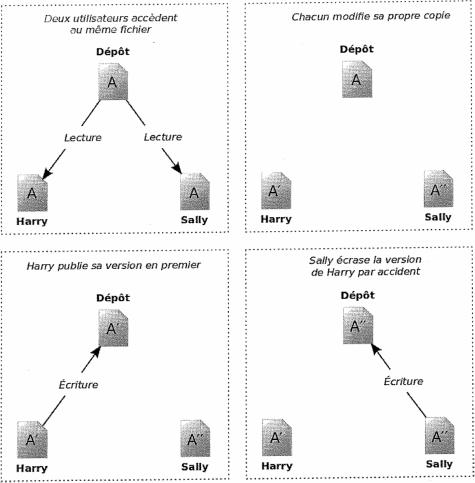
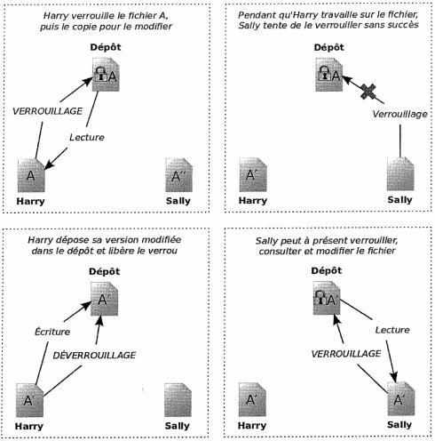
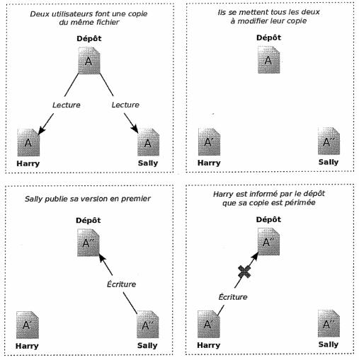

% Travaillons ensemble
% Division des enseignements en informatique
% décembre 2016

# Définitions #

## Le travail en groupe ##
 

* Le travail coopératif
* Le travail collaboratif

## La coopération ##
 

* Tâches fragmentées en sous-tâches
* Travail par cumul d'activités individuelles

## La collaboration ##
 

* Un seul but commun
* Travail par amalgame des contributions individuelles

## Les besoins ##
 

* Faciliter la programmation en groupe
	* Partage des ressources
	* Gestion des conflits
	* Outils de communication
* Faciliter la diffusion du travail

# Les wikis #

## Intérêts ##
 

* Adaptés pour les partages de connaissances
* Pas de gestion des conflits

## Principe ##

# Le cloud computing #

## Intérêts ##
 

* Mise en réseau de toutes les ressources
* Adapté pour les partages bureautiques

## Exemples ##
 

* GoogleApp
* Office 356
* Framasoft

## Principe ##

# SVN #

## Intérêts ##

* Architecture client-serveur
* Adapté aux développements en groupe

## Le serveur ##
 

* Contient la technologie subversive
* Gère la base de données
* Administration des dépôts
* Serveur web de consultation

## Le client ##
 

* Gère les transferts
* Gère les conflits
* Administration du dépôt

## Historique ##
 

* SCCS : Source Code Control System (1972)
* CVS : Concurrent Version System (1986)
* SVN : Subversion (2000)

## Exemples de clients ##
 

* Tortoire SVN (Windows)
* Subclipse
* XCode (OS X)
* Rapid SVN

## Principe ##

## Principe ##

## Vocabulaire ##
 

* Head : révision la plus à jour
* Checkout : copie locale de la head
* Commit : mise à jour du dépôt sur le serveur
* Update : mise à jour du checkout

# Git #

## Intérêts ##

* Architecture distribuée
* Adapté aux développements en groupe

## Exemple de client ##

* Git
* GitHub

## Vocabulaire ##

* Dépôt : copie du projet
* Initialiser : créer un projet vide (`git init`)
* Clone : récupérer l'historiques des changements d'un projet (`git clone`)
* Commit : enregistrer les modifications (`git add` puis `git commit`)

## Installation de Git ##

* Sous Ubuntu : `sudo apt-get install git-core`
* Sous Windows : <http://msysgit.github.io>
* SOus OS X : <https://code.google.com/archive/p/git-osx-installer/>

## Tutoriels ##

* <https://openclassrooms.com/courses/gerez-vos-codes-source-avec-git>
* <https://try.github.io/levels/1/challenges/1>

